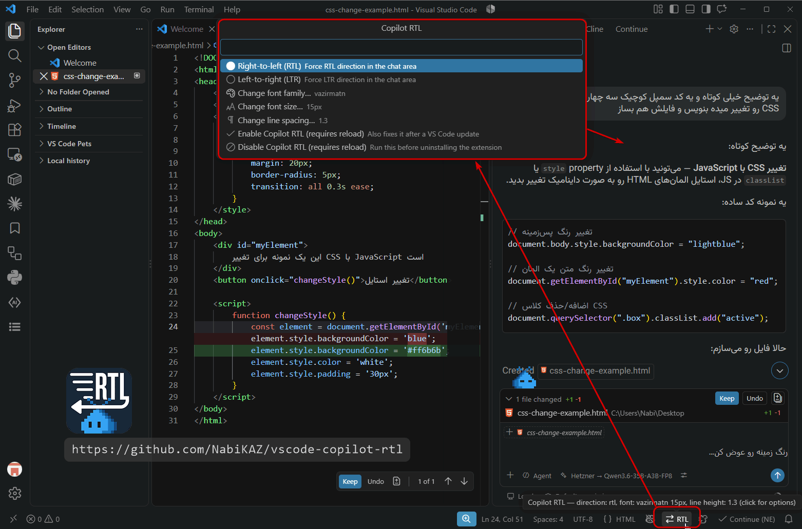

# Copilot Chat RTL Support

A Visual Studio Code extension that adds **Right-to-Left (RTL)** support to the GitHub Copilot Chat panel — optimized for Persian (Farsi) and other RTL languages.

## Features

- **Automatic direction per paragraph** — each paragraph, list item, heading and table cell gets its own RTL/LTR direction based on its text, so a mixed Persian/English conversation reads correctly (default)
- Or force RTL/LTR for the whole chat area — switchable anytime, **applies instantly, no reload**
- <kbd>Ctrl</kbd>+<kbd>Alt</kbd>+<kbd>R</kbd> cycles auto → RTL → LTR
- Custom font family, font size, and line spacing for the chat area — also instant, with a picker listing the fonts installed on your system
- Ships with the [Vazirmatn font](https://github.com/rastikerdar/vazirmatn) bundled, used automatically as a fallback if it isn't installed on your system
- Preserves LTR direction for code blocks
- Automatically detects RTL vs. LTR per line in the prompt input box
- Detects Persian, Arabic, Hebrew, Thaana, NKo and Syriac text
- Quick-access menu in the status bar for direction, font, size, and line spacing
- Re-applies itself on startup, and tells you when a VS Code update has reverted the patch

## Preview

Here is an example of the result after applying the extension:



## Installation

1. Install the extension from the [VS Code Marketplace](https://marketplace.visualstudio.com/items?itemName=NabiKAZ.vscode-copilot-rtl) (search for **"Copilot Chat RTL Support"**), or install the `.vsix` manually:
   ```
   code --install-extension vscode-copilot-rtl-X.X.X.vsix
   ```
2. Reload the window when prompted (or run **Developer: Reload Window**).

That's it — no console, no manual steps after the first reload. The [Vazirmatn font](https://github.com/rastikerdar/vazirmatn) is bundled with the extension, so it looks right even if you don't have it installed system-wide.

## Commands

| Command | Description |
|---|---|
| `Copilot RTL: Open Menu (direction, font, size…)` | Quick menu — also available by clicking the status bar item |
| `Copilot RTL: Cycle Direction (auto → RTL → LTR)` | Switch direction without opening the menu — bound to <kbd>Ctrl</kbd>+<kbd>Alt</kbd>+<kbd>R</kbd> (<kbd>Cmd</kbd>+<kbd>Alt</kbd>+<kbd>R</kbd> on macOS) |
| `Copilot RTL: Enable (requires reload)` | Apply the patch now — also the right thing to run if a VS Code update reverted it |
| `Copilot RTL: Disable (requires reload; run before uninstalling)` | Remove the patch and restore the original files |

## Status bar

A small item (e.g. `⇄ AUTO`, `← RTL`) sits in the bottom-right status bar. Click it anytime to switch between automatic/RTL/LTR, or to change the font family, size, or line spacing — no need to dig through Settings, and no reload: changes show up within about a second.

## Settings

| Setting | Default | Description |
|---|---|---|
| `copilotRtl.direction` | `auto` | `auto` (detect per paragraph/list item/heading), `rtl`, or `ltr` — direction used in the chat area (the prompt input box always auto-detects per line regardless) |
| `copilotRtl.fontFamily` | `Vazirmatn` | Font used in the chat area; falls back to Vazirmatn (bundled) if not installed |
| `copilotRtl.fontSize` | `13` | Font size in pixels used in the chat area |
| `copilotRtl.lineHeight` | `1.6` | Line spacing (line height multiplier) used in the chat area |
| `copilotRtl.autoEnable` | `true` | Automatically (re)apply the patch on startup |
| `copilotRtl.notifyWhenPatchReverted` | `true` | When `autoEnable` is off, warn if a VS Code update reverted the patch and offer to re-apply it |

All of the above can also be changed from the status bar menu instead of the Settings UI. `direction`, `fontFamily`, `fontSize`, and `lineHeight` all apply live — no reload needed. Only `autoEnable`, and the Enable/Disable commands, need one (see [TECHNICAL.md](./TECHNICAL.md) for why).

## ⚠️ Uninstalling

**Run the `Copilot RTL: Disable` command *before* uninstalling this extension** — not after.

How and where to run it:

1. Open the **Command Palette**:
   - Windows / Linux: <kbd>Ctrl</kbd>+<kbd>Shift</kbd>+<kbd>P</kbd>
   - macOS: <kbd>Cmd</kbd>+<kbd>Shift</kbd>+<kbd>P</kbd>
   - (or via the menu: **View > Command Palette…**)
2. Type `Copilot RTL: Disable` and press <kbd>Enter</kbd> when it appears in the list.
3. A notification will ask to reload — click **Reload Window**.
4. Only now go to the **Extensions** view (<kbd>Ctrl</kbd>/<kbd>Cmd</kbd>+<kbd>Shift</kbd>+<kbd>X</kbd>) and uninstall the extension.

If you already uninstalled without disabling first, see [TECHNICAL.md](./TECHNICAL.md#recovering-from-an-uninstall-without-disabling-first) for how to fix it.

## Manual (no-install) usage

If you'd rather not install anything, you can still run the original script by hand:

1. Open **Help > Toggle Developer Tools > Console**.
2. Paste the contents of [`rtl-fix.js`](./rtl-fix.js) and press **Enter**. (Edit the `DEFAULT_CONFIG` object near the top first if you want something other than the defaults — `direction` accepts `auto`, `rtl` or `ltr`; there's no live settings menu outside the extension.)
3. The effect is temporary and resets on reload — repeat whenever needed.

## To-Do & Improvements

- [x] Fix issue where LTR blocks sometimes disappear
- [x] Improve RTL support for the question input area
- [x] Package as a VS Code extension
- [x] Add a toggle to switch between RTL and LTR from the status bar
- [x] Bundle the Vazirmatn font as an automatic fallback
- [x] Custom font family and size
- [x] Line spacing control
- [x] Apply settings changes live, without a window reload
- [x] Automatic per-paragraph direction detection in the chat area
- [x] Keyboard shortcut to switch direction
- [x] Font picker listing installed system fonts
- [x] Notify when a VS Code update reverts the patch

## For developers

Curious how the patch actually works under the hood, or want to build/publish this extension yourself? See [TECHNICAL.md](./TECHNICAL.md).

## License

This project is licensed under the **GNU General Public License v3.0**. See the [LICENSE](./LICENSE) file for details.

## Support

If this project has been useful to you and you'd like to support its development:

- ⭐ **Give a Star**: Show your support with a ⭐ on the GitHub repository.
- 🌟 **Rate it**: Leave a [rating on the Marketplace](https://marketplace.visualstudio.com/items?itemName=NabiKAZ.vscode-copilot-rtl).
- 💎 **Donate**:
   - **USDT (TRC20)**: `TEHjxGqu5Y2ExKBWzArBJEmrtzz3mgV5Hb`
   - **TON**: `nabikaz.ton`
- 🐦 **Follow / say hi**: [x.com/NabiKAZ](https://x.com/NabiKAZ)

Thank you for being a part of this journey! 🚀
